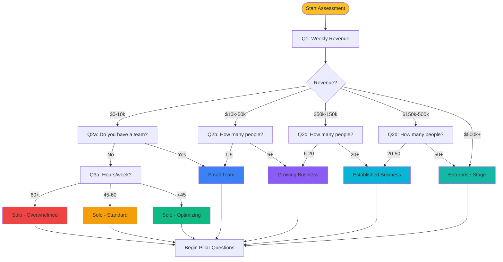
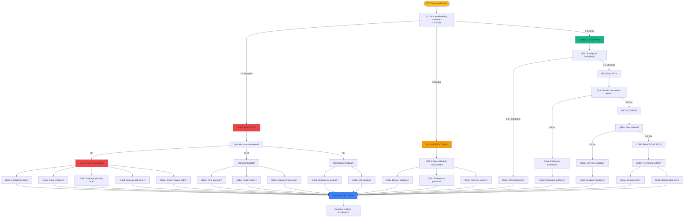
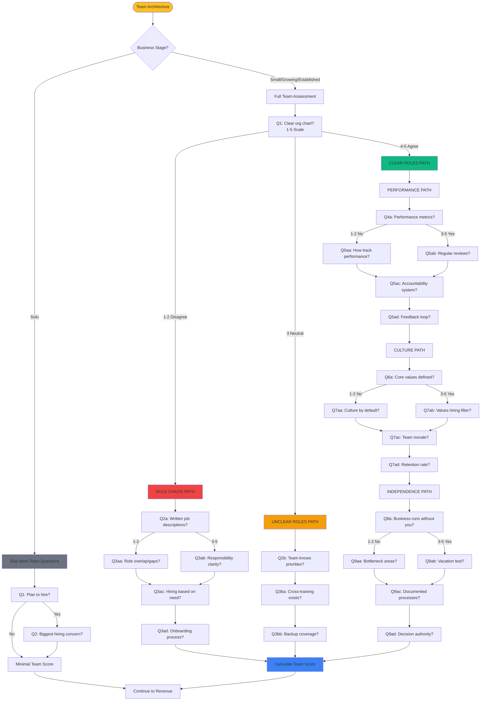
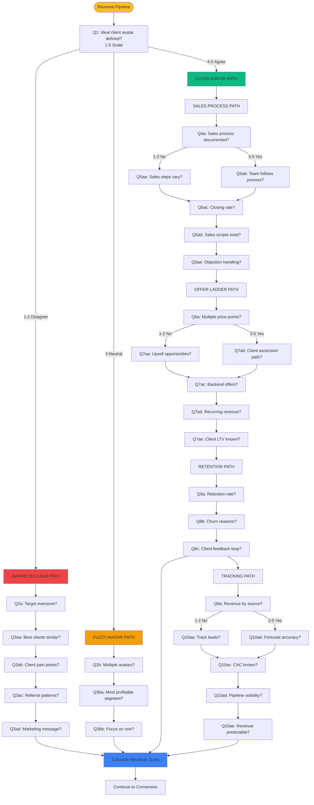
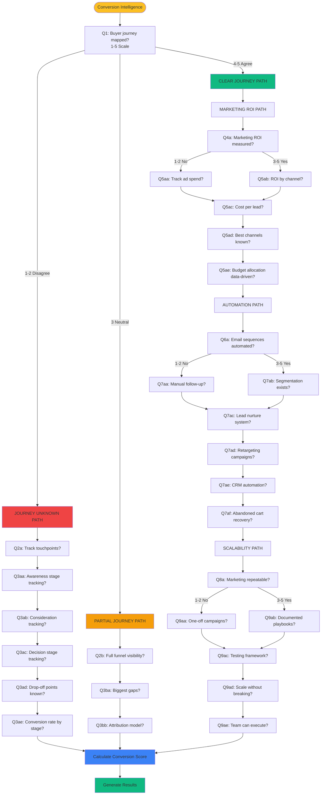
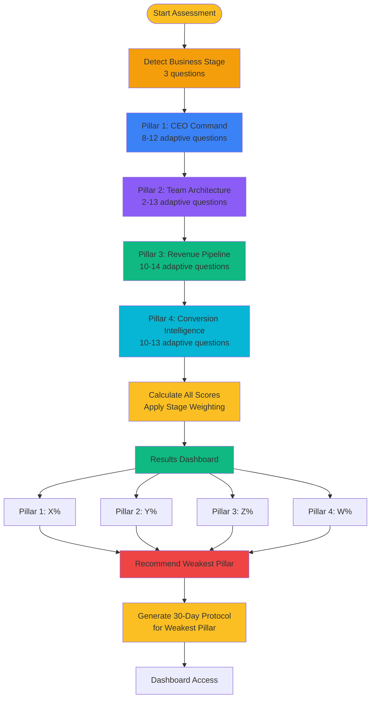

# Adaptive Assessment Visual Flowcharts

This document contains complete visual flowcharts for the adaptive assessment system across all 4 pillars. These Mermaid diagrams show the if/then branching logic that determines which questions users see based on their answers.

---

## Business Stage Detection Flow

---

## Pillar 1: CEO Command Center Flow

---

## Pillar 2: Team Architecture Flow

---

## Pillar 3: Revenue Pipeline Flow

---

## Pillar 4: Conversion Intelligence Flow

---

## Complete Assessment Flow (High-Level)

---

## Question Count Summary by Path

### Pillar 1: CEO Command Center
- **Time Chaos Path (1-2)**: 3-8 questions depending on hours worked
  - Overwhelmed (60+ hrs): 8 questions total
  - Standard (45-60 hrs): 6 questions total
  - Optimizing (<45 hrs): 5 questions total
- **Inconsistent Path (3)**: 6 questions
- **Structured Path (4-5)**: 5-9 questions depending on metrics maturity

**Total Range**: 5-9 questions per user

---

### Pillar 2: Team Architecture
- **Solo Stage**: 2 questions (skip most team questions)
- **Role Chaos Path**: 7 questions
- **Unclear Roles Path**: 6 questions
- **Clear Roles Path**: 10-13 questions (full assessment)

**Total Range**: 2-13 questions depending on stage/maturity

---

### Pillar 3: Revenue Pipeline
- **Avatar Unclear Path**: 8 questions
- **Fuzzy Avatar Path**: 6 questions
- **Clear Avatar Path**: 10-14 questions (full pipeline assessment)

**Total Range**: 6-14 questions per user

---

### Pillar 4: Conversion Intelligence
- **Journey Unknown Path**: 9 questions
- **Partial Journey Path**: 7 questions
- **Clear Journey Path**: 10-13 questions

**Total Range**: 7-13 questions per user

---

## Total Assessment Length

**Business Stage Detection**: 3 questions

**Pillar Questions**:
- Minimum path: 5 + 2 + 6 + 7 = **20 pillar questions**
- Average path: 7 + 7 + 10 + 10 = **34 pillar questions**
- Maximum path: 9 + 13 + 14 + 13 = **49 pillar questions**

**Total Assessment Length**:
- **Minimum**: 23 questions (~5 minutes)
- **Average**: 37 questions (~8 minutes)
- **Maximum**: 52 questions (~11 minutes)

**Current System**: 120 questions (~25 minutes)

**Efficiency Gain**: 50-70% reduction in time while maintaining accuracy through adaptive branching.

---

## Branching Rules Summary

### Answer Scale Mapping
- **1-2 (Strongly Disagree/Disagree)**: Problem exists → Ask detailed diagnostic questions
- **3 (Neutral)**: Inconsistent/Partial → Ask moderate depth questions
- **4-5 (Agree/Strongly Agree)**: System exists → Skip basics, ask advanced questions

### Business Stage Weighting
Each business stage has different pillar priorities:

| Stage | CEO Time | Team | Revenue | Marketing |
|-------|----------|------|---------|-----------|
| Solo - Overwhelmed | 40% | 10% | 40% | 10% |
| Solo - Optimizing | 30% | 15% | 35% | 20% |
| Small Team | 25% | 30% | 30% | 15% |
| Growing | 25% | 25% | 25% | 25% |
| Established | 20% | 35% | 25% | 20% |
| Enterprise | 25% | 30% | 20% | 25% |

### Path Skip Logic
- **Solo operators**: Skip most team architecture questions (2 instead of 10+)
- **High scores (4-5)**: Skip basic questions, go straight to advanced
- **Low scores (1-2)**: Deep dive into problem areas with diagnostic questions
- **Stage-based**: Certain questions only shown to specific business stages

---

## Next Steps

1. **Review these flowcharts** - Do the branching paths make sense?
2. **Identify any missing paths** - Are there scenarios we haven't covered?
3. **Validate question pools** - Do we need to add/remove questions?
4. **Approve framework** - Ready to move to implementation?

Once approved, we'll implement:
- Question tree data structure
- Branching engine
- UI for adaptive quiz
- Multi-pillar results page
- Recommendation algorithm
