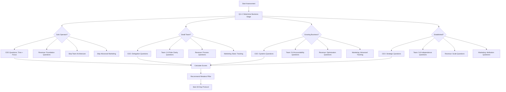
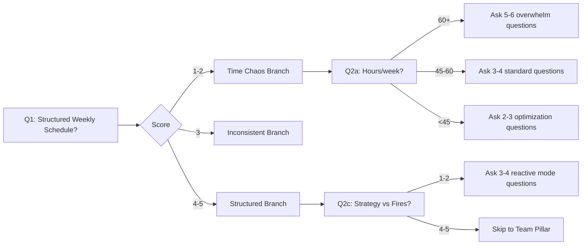

# Adaptive Assessment Framework - If/Then Branching Logic
## Unshakable Empire O.S.

**Created:** February 10, 2026
**Purpose:** Design dynamic assessment that covers all 4 pillars with 40-50 questions (vs 120 linear)
**Approach:** Start broad → Dial in based on answers → Recommend weakest pillar

---

## Executive Summary

**Current System:**
- 120 questions total (30 per pillar)
- Linear path (everyone gets same questions)
- User picks pillar first
- 30-40 minute completion time

**New Adaptive System:**
- 40-50 questions total
- Dynamic branching based on answers
- Covers all 4 pillars automatically
- 12-18 minute completion time
- Recommends weakest pillar at end

---

## Part 1: Branching Framework Design

### The 3-Tier Question Strategy

**Tier 1: Qualifier Questions (12 questions)**
- 3 questions per pillar
- Broad diagnostic questions
- Determine business stage and current state
- Branch logic activated here

**Tier 2: Deep-Dive Questions (20-25 questions)**
- Adaptive based on Tier 1 answers
- Go deep where problems exist
- Skip areas that score high
- Tailored to business stage

**Tier 3: Precision Questions (8-13 questions)**
- Final calibration
- Edge case scenarios
- Validate earlier responses
- Lock in recommendation

**Total:** 40-50 questions (vs 120)
**Time:** 12-18 minutes (vs 30-40 minutes)

---

## Part 2: Business Stage Classification

### Stage Detection Logic

Based on first 4 questions, classify user into one of 5 stages:

#### Stage 1: Solo Operator ($0-10k/month)
**Indicators:**
- No team (just me)
- Revenue under $10k/month
- Working 60+ hours/week
- Wearing all hats

**Assessment Path:**
- Focus: CEO time management + revenue foundation
- Skip: Team scalability, enterprise metrics
- Questions: 35-40 total

#### Stage 2: Small Team ($10k-50k/month)
**Indicators:**
- 1-5 team members
- Revenue $10k-50k/month
- First delegations happening
- Process documentation starting

**Assessment Path:**
- Focus: Delegation + team clarity + sales process
- Skip: Advanced team architecture
- Questions: 40-45 total

#### Stage 3: Growing Business ($50k-150k/month)
**Indicators:**
- 6-20 team members
- Revenue $50k-150k/month
- Department structure emerging
- Scaling pains visible

**Assessment Path:**
- Focus: Systems + accountability + marketing optimization
- All pillars relevant
- Questions: 45-50 total

#### Stage 4: Established Business ($150k-500k/month)
**Indicators:**
- 20+ team members
- Revenue $150k-500k/month
- Clear departments
- Looking to scale

**Assessment Path:**
- Focus: Leadership elevation + enterprise systems
- All pillars with advanced questions
- Questions: 45-50 total

#### Stage 5: Enterprise ($500k+/month)
**Indicators:**
- 50+ team members
- Revenue $500k+/month
- Executive team in place
- Optimization mode

**Assessment Path:**
- Focus: Strategic delegation + market expansion
- Advanced diagnostics only
- Questions: 40 total (skips basics)

---

## Part 3: Branching Logic Map

### Pillar 1: CEO Command Center

#### Q1 (Qualifier): "Do you have a structured weekly schedule you follow consistently?"
```
├─ 1-2 (Strongly Disagree/Disagree)
│  → BRANCH: Time Chaos Path
│  → Ask: Q2a "How many hours/week do you work?"
│         ├─ >60 hours → CEO overwhelm subpath
│         └─ <60 hours → Lack of structure subpath
│
├─ 3 (Neutral)
│  → BRANCH: Inconsistent Rhythm Path
│  → Ask: Q2b "What derails your schedule most often?"
│
└─ 4-5 (Agree/Strongly Agree)
   → SKIP deeper time management questions
   → Ask: Q2c "Do you spend time on strategic growth vs firefighting?"
```

#### Q2a (If 1-2): "How many hours per week do you typically work?"
```
├─ 60+ hours
│  → BRANCH: Overwhelm Path
│  → Ask: "Can you identify your top 3 priorities each Monday?"
│  → Ask: "Do you delegate regularly?"
│  → Ask: "Do you have blocked strategy time?"
│  → SKIP: Advanced time optimization questions
│
├─ 45-60 hours
│  → BRANCH: Standard CEO Path
│  → Ask balanced mix of questions
│
└─ <45 hours
   → BRANCH: Optimization Path
   → Skip basics, ask advanced delegation questions
```

#### Q2c (If 4-5): "Do you spend more time on strategic growth vs daily fires?"
```
├─ 1-2 (More fires than strategy)
│  → BRANCH: Reactive CEO despite structure
│  → Ask: "Does your team make operational decisions without you?"
│  → Ask: "What's your decision filter?"
│
└─ 4-5 (More strategy than fires)
   → SKIP most CEO time questions
   → Move to next pillar quickly
```

---

### Pillar 2: Team Architecture

#### Q3 (Qualifier): "Do you currently have a team?"
```
├─ NO (Solo operator)
│  → BRANCH: Solo Path
│  → Ask: "Planning to hire in next 6 months?"
│  │    ├─ YES → Hiring readiness questions (3-4 Qs)
│  │    └─ NO → Skip entire team pillar → Focus on CEO + Revenue
│  → SCORE: Auto-score team as "Critical" (needs building)
│
└─ YES (Has team)
   → BRANCH: Team Size Path
   → Ask: Q4 "How many team members?"
```

#### Q4 (If has team): "How many team members do you have?"
```
├─ 1-3 people
│  → BRANCH: Micro Team Path
│  → Ask: "Do they have clear role definitions?"
│  → Ask: "Can they operate independently for a day?"
│  → Skip: Department structure, org chart questions
│
├─ 4-10 people
│  → BRANCH: Small Team Path
│  → Ask: "Do you have defined roles and scorecards?"
│  → Ask: "How often do they escalate decisions to you?"
│  → Ask: "Do you have accountability systems?"
│
├─ 11-25 people
│  → BRANCH: Growing Team Path
│  → Ask: "Do you have department leads?"
│  → Ask: "Can business run without you for a week?"
│  → Ask: "Do you have clear org chart?"
│
└─ 26+ people
   → BRANCH: Enterprise Team Path
   → Skip basics
   → Ask: "Do departments operate autonomously?"
   → Ask: "Do you have executive team in place?"
```

---

### Pillar 3: Revenue Pipeline

#### Q5 (Qualifier): "What's your current monthly revenue?"
```
├─ $0-10k
│  → BRANCH: Foundation Path
│  → Ask: "Do you have a defined sales process?"
│  → Ask: "Do you know your ideal client avatar?"
│  → Skip: LTV, retention, enterprise sales questions
│
├─ $10k-50k
│  → BRANCH: Scaling Revenue Path
│  → Ask: "Is revenue consistent or variable month-to-month?"
│  │    ├─ Variable → Focus on predictability questions
│  │    └─ Consistent → Focus on optimization questions
│
├─ $50k-150k
│  → BRANCH: Optimization Path
│  → Ask: "Do you track customer lifetime value?"
│  → Ask: "Do you have an offer ladder?"
│  → Ask: "What's your client retention rate?"
│
└─ $150k+
   → BRANCH: Enterprise Revenue Path
   → Ask: "Do you have a sales team?"
   → Ask: "What's your acquisition cost vs LTV?"
   → Focus on advanced metrics
```

#### Q6 (Follow-up): "Can you describe your ideal client avatar beyond 'someone who pays'?"
```
├─ 1-2 (No, can't describe)
│  → BRANCH: Avatar Clarity Problem
│  → Ask: "Do you have a documented sales process?"
│  → Ask: "Is most revenue from one-time or repeat clients?"
│  → Focus on foundation
│
├─ 3 (Somewhat)
│  → BRANCH: Needs Refinement
│  → Ask: "Do you track which clients are most profitable?"
│  → Ask: "Do you have client segmentation?"
│
└─ 4-5 (Yes, very clear)
   → SKIP avatar questions
   → Move to offer ladder and optimization
```

---

### Pillar 4: Conversion Intelligence

#### Q7 (Qualifier): "Do you track which marketing activities drive actual revenue?"
```
├─ 1-2 (No tracking)
│  → BRANCH: Dark Mode Marketing
│  → Ask: "Do you know your cost per lead?"
│  → Ask: "Do you have any marketing automation?"
│  → Ask: "Where do most leads come from?" (awareness check)
│  → Focus on visibility and tracking setup
│
├─ 3 (Some tracking)
│  → BRANCH: Partial Visibility
│  → Ask: "Do you track conversion rates at each funnel stage?"
│  → Ask: "Do you know which channels have best ROI?"
│
└─ 4-5 (Full tracking)
   → SKIP basic tracking questions
   → Ask: "Do you run optimization experiments?"
   → Ask: "Do you have attribution modeling?"
   → Focus on advanced optimization
```

#### Q8 (Follow-up): "Do you have marketing automation sequences in place?"
```
├─ NO
│  → BRANCH: Manual Marketing Path
│  → Ask: "How long does it take to follow up with a lead?"
│  → Ask: "Do you lose leads due to slow response?"
│  → Focus on automation foundation
│
└─ YES
   → BRANCH: Automation Maturity Path
   → Ask: "Do you optimize sequences based on data?"
   → Ask: "Do you personalize based on lead behavior?"
   → Focus on optimization
```

---

## Part 4: Branching Decision Tree (Visual)

### High-Level Flow



### Detailed CEO Command Center Branch



---

## Part 5: Question Pool Organized by Branch

### CEO Command Center Question Pool

#### Tier 1: Qualifiers (Everyone)
1. "Do you have a structured weekly schedule you follow consistently?" (1-5)
2. "How many hours per week do you typically work?" (Open number → Auto-convert to score)
3. "Do you spend more time on strategic growth or daily firefighting?" (1-5)

#### Tier 2A: Time Chaos Branch (If Q1 = 1-2)
4. "Can you identify your top 3 priorities for the week before Monday?" (1-5)
5. "Do you have blocked time specifically for strategy and planning?" (1-5)
6. "How often do you get pulled into tasks someone else could handle?" (1-5 inverted)
7. "Do you have a clear morning routine?" (1-5)

#### Tier 2B: Delegation Branch (If overwhelmed)
8. "Does your team make operational decisions without your approval?" (1-5)
9. "Do you have clear decision filters for what requires your input?" (1-5)
10. "Have you delegated at least 3 major responsibilities in last 90 days?" (1-5)

#### Tier 2C: Optimization Branch (If Q1 = 4-5, Q3 = 4-5)
11. "Do you have a weekly CEO scorecard with 3-5 key metrics?" (1-5)
12. "Can your business operate smoothly when you're unavailable for a week?" (1-5)

### Team Architecture Question Pool

#### Tier 1: Qualifiers
13. "Do you currently have a team?" (Yes/No → If No, skip most team questions)
14. "How many team members do you have?" (0 / 1-3 / 4-10 / 11-25 / 26+)

#### Tier 2A: Solo → Hiring Readiness Branch
15. "Are you planning to hire in the next 6 months?" (Yes/No)
16. "Do you have documented role definitions for your first hire?" (1-5)

#### Tier 2B: Small Team (1-10) Branch
17. "Do your team members have clearly defined roles and outcomes?" (1-5)
18. "Can they operate independently when you're gone for a day?" (1-5)
19. "Do you have performance metrics for each role?" (1-5)
20. "How often do they escalate decisions to you?" (1-5 inverted)

#### Tier 2C: Growing Team (11+) Branch
21. "Do you have department leads who manage their own teams?" (1-5)
22. "Can your business run for a week without your involvement?" (1-5)
23. "Do you have clear org chart and reporting structure?" (1-5)
24. "Do you have a documented accountability system?" (1-5)

### Revenue Pipeline Question Pool

#### Tier 1: Qualifiers
25. "What's your current average monthly revenue?" ($0-10k / $10k-50k / $50k-150k / $150k+)
26. "Can you describe your ideal client avatar beyond 'someone who pays'?" (1-5)

#### Tier 2A: Foundation Revenue Branch ($0-10k)
27. "Do you have a documented, repeatable sales process?" (1-5)
28. "Do you know where your best clients come from?" (1-5)
29. "Is your revenue consistent or highly variable month-to-month?" (Consistent = 5, Variable = 1)

#### Tier 2B: Scaling Revenue Branch ($10k-50k)
30. "Do you have an offer ladder (entry → mid → high-tier)?" (1-5)
31. "Do you track which clients generate the most profit?" (1-5)
32. "What percentage of clients are repeat vs one-time?" (Track for LTV score)
33. "Do you have a sales team or is it just you?" (Team = higher tier questions)

#### Tier 2C: Optimization Branch ($50k+)
34. "Do you know your customer lifetime value (LTV)?" (1-5)
35. "Do you track customer acquisition cost (CAC)?" (1-5)
36. "Do you have a client retention strategy?" (1-5)
37. "Do you have upsell/cross-sell processes?" (1-5)

### Conversion Intelligence Question Pool

#### Tier 1: Qualifiers
38. "Do you track which marketing activities drive actual revenue?" (1-5)
39. "Do you have marketing automation sequences in place?" (Yes/No)

#### Tier 2A: Dark Mode Marketing Branch (Q38 = 1-2)
40. "Do you know your cost per lead?" (1-5)
41. "Where do most of your leads come from?" (Awareness check)
42. "How long does it take to follow up with a new lead?" (Speed to lead)
43. "Do you lose opportunities due to slow response time?" (1-5 inverted)

#### Tier 2B: Partial Tracking Branch (Q38 = 3)
44. "Do you track conversion rates at each funnel stage?" (1-5)
45. "Do you know which marketing channels have the best ROI?" (1-5)
46. "Do you run experiments to optimize conversion?" (1-5)

#### Tier 2C: Advanced Branch (Q38 = 4-5)
47. "Do you have attribution modeling to track customer journey?" (1-5)
48. "Do you personalize sequences based on lead behavior?" (1-5)
49. "Do you have a systematic approach to A/B testing?" (1-5)

---

## Part 6: Scoring Algorithm with Branching

### Adaptive Scoring Logic

**Challenge:** Not everyone answers same questions, so direct comparison doesn't work.

**Solution:** Weighted category scoring based on questions asked.

#### Scoring Formula

```typescript
interface CategoryScore {
  category: string;
  questionsAsked: number;
  totalPossible: number;
  rawScore: number;
  percentage: number;
  weight: number; // Based on business stage
}

function calculateAdaptiveScore(
  answers: Record<string, number>,
  questionPath: string[],
  businessStage: BusinessStage
): PillarScore {
  // 1. Group questions by pillar and category
  const categoryGroups = groupByCategory(questionPath);

  // 2. Calculate raw score for each category
  const categoryScores = categoryGroups.map(group => {
    const answered = group.questions.filter(q => answers[q.id]);
    const rawScore = answered.reduce((sum, q) => sum + answers[q.id], 0);
    const totalPossible = answered.length * 5;

    return {
      category: group.category,
      questionsAsked: answered.length,
      rawScore,
      totalPossible,
      percentage: (rawScore / totalPossible) * 100,
      weight: getWeightForStage(businessStage, group.category)
    };
  });

  // 3. Calculate weighted pillar score
  const weightedAverage = categoryScores.reduce((sum, cat) => {
    return sum + (cat.percentage * cat.weight);
  }, 0) / categoryScores.reduce((sum, cat) => sum + cat.weight, 0);

  return {
    pillar: pillarId,
    overallPercentage: Math.round(weightedAverage),
    categoryScores,
    questionsAsked: questionPath.length
  };
}
```

#### Stage-Based Weighting

Different questions matter more at different stages:

**Solo Operator Stage:**
- CEO Time Management: 40% weight
- Revenue Foundation: 40% weight
- Team: 10% weight
- Marketing: 10% weight

**Small Team Stage:**
- CEO Delegation: 30% weight
- Team Clarity: 30% weight
- Revenue Process: 25% weight
- Marketing: 15% weight

**Growing Business Stage:**
- All pillars: 25% weight each (balanced)

**Established Business Stage:**
- CEO Strategy: 20% weight
- Team Independence: 35% weight
- Revenue Optimization: 25% weight
- Marketing Attribution: 20% weight

---

## Part 7: Implementation Roadmap

### Phase 1: Question Tree Data Structure (1-2 days)

Create new data structure:

```typescript
// src/data/questions/adaptive-tree.ts

interface QuestionNode {
  id: string;
  text: string;
  subtext: string;
  pillar: PillarId;
  category: string;
  tier: 1 | 2 | 3; // Qualifier, Deep-Dive, Precision
  responseType: 'scale' | 'boolean' | 'number' | 'select';

  // Branching logic
  branches?: {
    condition: (answer: number | boolean | string) => boolean;
    next: string; // Next question ID
  }[];

  // Default next if no branch matches
  defaultNext?: string;

  // Auto-scoring (for non-scale questions)
  scoreMapping?: (answer: any) => number; // Convert to 1-5 scale
}

const ADAPTIVE_QUESTION_TREE: Record<string, QuestionNode> = {
  'start': {
    id: 'start',
    text: 'Let\'s start with your current business stage...',
    // ... continues
  },

  'q1-ceo-schedule': {
    id: 'q1-ceo-schedule',
    text: 'Do you have a structured weekly schedule you follow consistently?',
    subtext: 'Think about whether you have a predictable weekly rhythm...',
    pillar: 1,
    category: 'Time & Focus',
    tier: 1,
    responseType: 'scale',
    branches: [
      {
        condition: (answer) => answer <= 2,
        next: 'q2a-hours-per-week'
      },
      {
        condition: (answer) => answer === 3,
        next: 'q2b-schedule-derails'
      },
      {
        condition: (answer) => answer >= 4,
        next: 'q2c-strategy-vs-fires'
      }
    ]
  },

  // ... rest of tree
};
```

### Phase 2: Branching Engine (1 day)

```typescript
// src/lib/adaptive-engine.ts

class AdaptiveAssessmentEngine {
  private currentNode: string = 'start';
  private answers: Map<string, any> = new Map();
  private questionPath: string[] = [];
  private businessStage?: BusinessStage;

  getNextQuestion(): QuestionNode | null {
    const node = ADAPTIVE_QUESTION_TREE[this.currentNode];
    if (!node) return null;

    this.questionPath.push(this.currentNode);
    return node;
  }

  submitAnswer(questionId: string, answer: any): void {
    this.answers.set(questionId, answer);

    // Determine business stage after initial questions
    if (this.questionPath.length === 4) {
      this.businessStage = this.detectBusinessStage();
    }

    // Find next question based on branching logic
    const currentNode = ADAPTIVE_QUESTION_TREE[questionId];
    if (!currentNode.branches) {
      this.currentNode = currentNode.defaultNext || 'end';
      return;
    }

    for (const branch of currentNode.branches) {
      if (branch.condition(answer)) {
        this.currentNode = branch.next;
        return;
      }
    }

    this.currentNode = currentNode.defaultNext || 'end';
  }

  calculateResults(): AssessmentResults {
    // Use adaptive scoring algorithm from Part 6
    return calculateAdaptiveScore(
      Object.fromEntries(this.answers),
      this.questionPath,
      this.businessStage!
    );
  }

  private detectBusinessStage(): BusinessStage {
    // Logic to determine stage from first 4 questions
    const hasTeam = this.answers.get('q-has-team');
    const teamSize = this.answers.get('q-team-size');
    const revenue = this.answers.get('q-monthly-revenue');

    if (!hasTeam || revenue < 10000) return 'solo';
    if (teamSize <= 5 && revenue < 50000) return 'small-team';
    if (teamSize <= 20 && revenue < 150000) return 'growing';
    if (teamSize <= 50 && revenue < 500000) return 'established';
    return 'enterprise';
  }
}
```

### Phase 3: UI Updates (1-2 days)

Update quiz page to use adaptive engine instead of linear array.

### Phase 4: Results Page (1 day)

Show all 4 pillar scores + recommend weakest one.

---

## Part 8: Plotting & Visualization Tools

### Tool 1: Mermaid Flowchart Generator

I'll create a script that converts the question tree into visual Mermaid diagrams:

```bash
# Generate flowchart for CEO Command Center branch
npm run generate-flowchart --pillar=ceo --output=docs/flowcharts/
```

### Tool 2: Interactive Question Tree Editor

Web-based tool to:
- Visualize entire question tree
- Add/edit/remove questions
- Define branching conditions
- Test paths
- Export to TypeScript

### Tool 3: Path Simulator

Test tool that simulates different answer patterns:
```
Input: Solo operator, 70 hrs/week, no team, $8k revenue, no marketing tracking
Output:
  - Questions asked: 38
  - Path taken: Solo → CEO Overwhelm → Revenue Foundation → Skip Team → Dark Mode Marketing
  - Recommended pillar: CEO Command Center (42%)
  - Time: 14 minutes
```

---

## Next Steps

**Decision Points:**

1. **Approve this branching framework?**
   - Yes → I'll start building the question tree
   - No → Tell me what to adjust

2. **Want to see visual flowcharts first?**
   - Yes → I'll generate Mermaid diagrams for each pillar
   - No → Skip to implementation

3. **Start with one pillar as proof of concept?**
   - Yes → Which pillar? (Recommend CEO Command Center)
   - No → Build all 4 at once

**My Recommendation:**
1. Generate visual flowcharts for all 4 pillars (30 minutes)
2. Review and refine branching logic together
3. Build proof-of-concept with CEO pillar (1 day)
4. Test with real scenarios
5. Expand to all 4 pillars (2-3 days)
6. Launch adaptive assessment

---

**Ready to proceed?** Let me know which next step you want!
